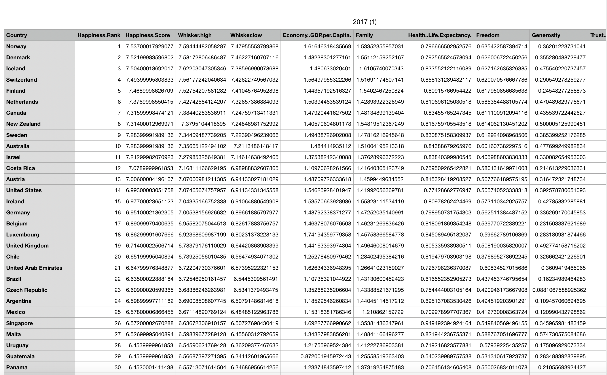

### ETL-Project

### Data analysis that identifies the happiness ratio between 2016 and 2017 of countries around the world. The data sets were downloaded from:

https://www.kaggle.com/unsdsn/world-happiness#2016.csv and here: https://www.kaggle.com/unsdsn/world-happiness#2017.csv

### Read the CSV files into a pandas dataframe and perform data cleaning to eliminate unwanted fields and columns to could possibly ruin out results and not needed to analyze.

### Transform the dataframe to remove possible duplicated fields, renaming columns and rounding up decimal point from four (4) or more to two (2).

### created a database connection to load the dataframe into a postgres database. 

### The below image is a summary of the entire ETL process from downloading the CSV, manipulating the data, cleaning, remaning and transferring to a postgres database.

